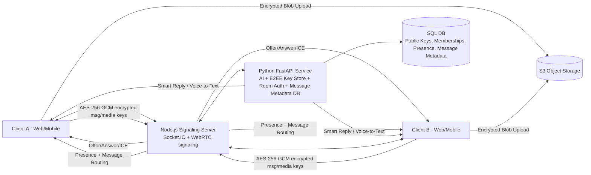

# Hybrid Chat Backend (Node Signaling + Python AI/DB)

## Architecture Diagram (Text-based)



## Implemented Services

### Node.js Signaling Server
- Path: `apps/signaling`
- Handles:
  - Socket authentication with JWT
  - Room authorization (delegated to Python service)
  - WebRTC signaling events (`webrtc:offer`, `webrtc:answer`, `webrtc:ice-candidate`, `call:end`)
  - Encrypted message/media routing (`message:send`)
  - Key publish events (`key:publish`)
  - Presence broadcasts (`presence:update`)
  - Event rate-limiting and payload validation (zod)

### Python FastAPI Service
- Path: `services/ai-python`
- Handles:
  - Public key store (`/v1/keys/public`)
  - Room membership auth checks (`/v1/rooms/{room_id}/authorize/{user_id}`)
  - Encrypted message metadata persistence (`/v1/messages/encrypted`)
  - Presence updates (`/v1/presence`)
  - AI endpoints (`/v1/ai/smart-reply`, `/v1/ai/voice-to-text`)
  - ICE server config endpoint (`/v1/rtc/ice-servers`)

## E2EE Design

1. Key exchange:
- Each user generates a local long-term key pair (recommended: `X25519` for key agreement).
- Client publishes only public key to Python key store (`PUT /v1/keys/public`).
- For each message/call frame key, sender generates a random symmetric key.
- Sender encrypts symmetric key separately for each recipient using recipient public key (envelope encryption).

2. Message/media encryption:
- Payload encryption algorithm: `AES-256-GCM` (client-side only).
- Inputs:
  - `plaintext`
  - `messageKey` (32 bytes)
  - `iv` (12 bytes random)
- Output sent to server:
  - `ciphertext`, `iv`, `authTag`, `keyEnvelope`.

3. Media sharing:
- Client encrypts media file bytes before upload.
- Upload encrypted blob to object storage (S3 key only, no plaintext).
- Send encrypted metadata through `message:send` with blob key + MIME + size.
- Receiver decrypts `messageKey` via private key, then decrypts blob locally.

## Client-Side Logic (Pseudo-code)

```text
function sendEncryptedMessage(roomId, plainText, recipientPublicKeys):
  messageKey = randomBytes(32)
  iv = randomBytes(12)

  {ciphertext, authTag} = AES_256_GCM_ENCRYPT(messageKey, iv, plainText)

  envelopes = {}
  for each recipient in recipientPublicKeys:
    envelopes[recipient.userId] = ASYMMETRIC_ENCRYPT(recipient.publicKey, messageKey)

  socket.emit('message:send', {
    roomId,
    ciphertext: base64(ciphertext),
    iv: base64(iv),
    authTag: base64(authTag),
    keyEnvelope: base64(serialize(envelopes)),
    media: []
  })

function startWebRTCCall(roomId, peerUserId):
  pc = new RTCPeerConnection(fetchIceConfig())
  setupLocalTracks(pc)

  pc.onicecandidate = (candidate) => {
    if candidate:
      socket.emit('webrtc:ice-candidate', { callId, roomId, toUserId: peerUserId, candidate })
  }

  offer = await pc.createOffer()
  await pc.setLocalDescription(offer)

  socket.emit('webrtc:offer', {
    callId,
    roomId,
    toUserId: peerUserId,
    sdp: offer.sdp
  })
```

## Security Checklist (MITM-focused)

1. **Verify peer identity for key exchange**
- Pin and verify recipient public key fingerprints before trusting key envelopes.

2. **Enforce DTLS-SRTP in WebRTC and validate signaling auth**
- Reject unauthenticated Socket.IO clients and use short-lived JWTs.

3. **Use authenticated encryption (AES-256-GCM) + unique IV per message/file chunk**
- Never reuse IV with same key; reject payloads with invalid auth tags.

4. **Harden transport with TLS + certificate pinning (mobile)**
- Protect signaling and API channels from interception/downgrade attacks.

5. **Room membership authorization on every signaling/message event**
- Do not trust client room claims; server re-checks membership before routing.

## Local Run

### Node signaling
```bash
npm run dev --workspace @qweb/signaling
```

### Python AI service
```bash
cd services/ai-python
python -m venv .venv
source .venv/bin/activate
pip install -r requirements.txt
uvicorn app.main:app --reload --port 8000
```
